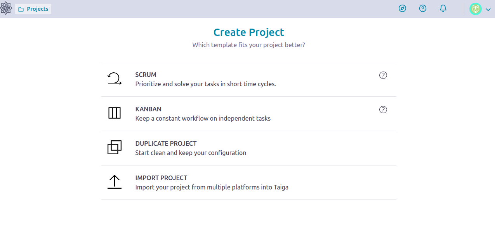
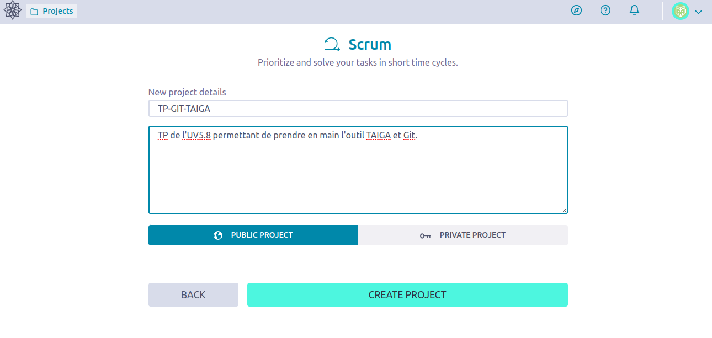
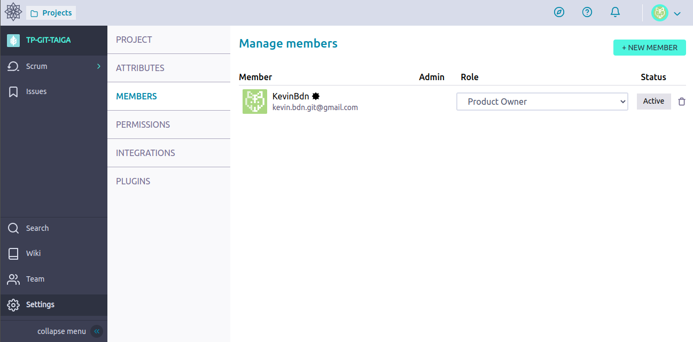
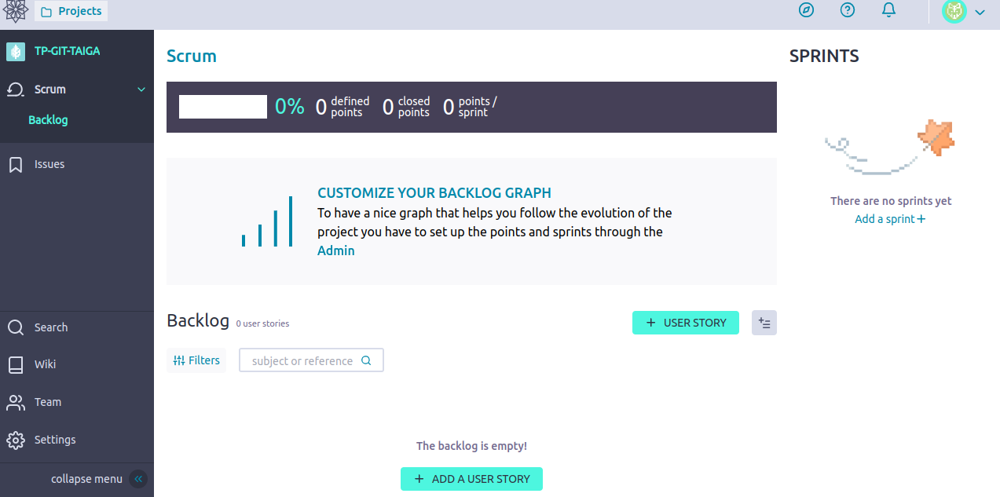
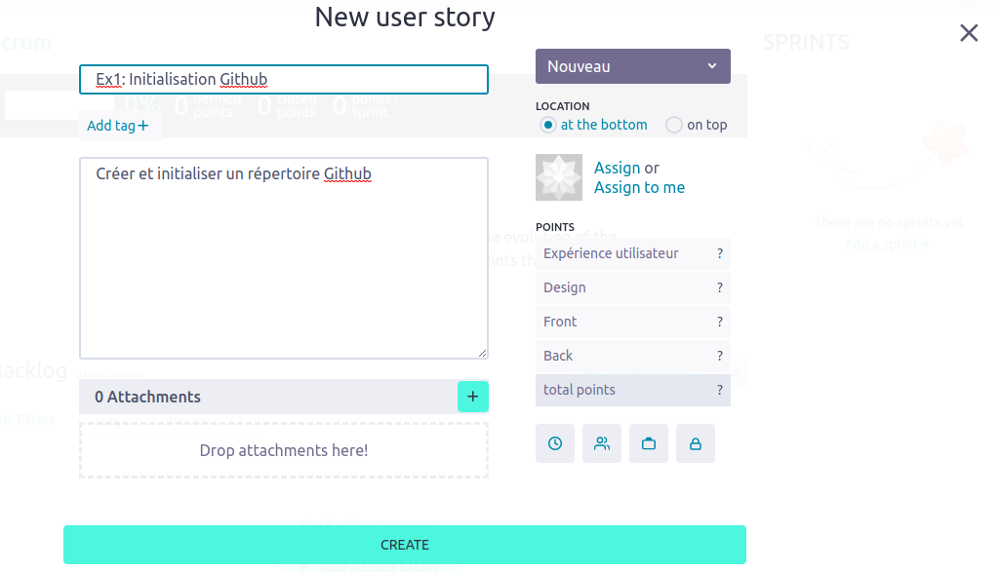
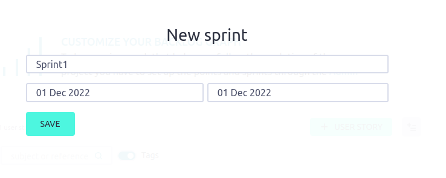
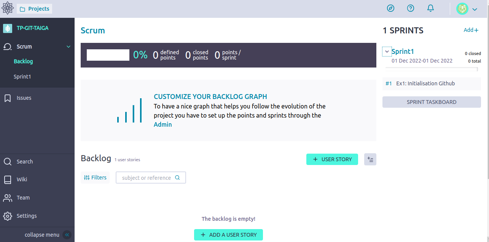
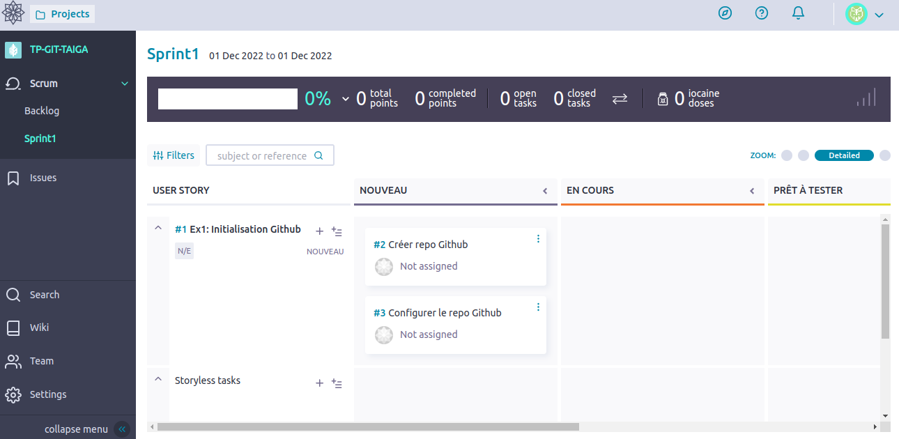
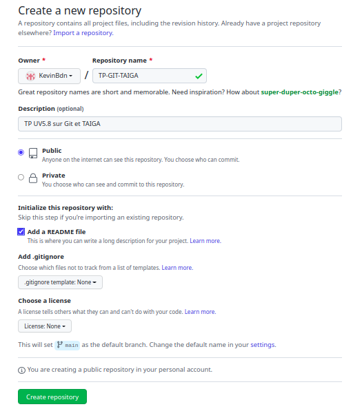

Exercice 1
===

### Objectifs
--- 

* **TAIGA**: Créer un projet Scrum, ajouter les membres, créer le premier *Sprint* et les *User Stories* associées
* **GIT**: Initialiser le repertoire Github

---	
### Consignes

* **[PO]** 

	1. Créer le projet **TAIGA** `TP-GIT-TAIGA` avec le framework **SCRUM** ([https://tree.taiga.io](https://tree.taiga.io)).
	
	 
	 
	
	2. Ajouter le **GM** au projet. Vous pouvez créer des rôles suivants les droits à attribuer aux différents membres via la rubrique `PERMISSIONS`.
	
	 

	3. Créer les *User Stories* (*US*) associées aux exercices 1 et 2 en se basant sur les objectifs décrits dans le fichier README.md principal. Pour cela il faut prendre connaissance des 2 premiers exercices.

	 
	 

	4. Créer le 1er *Sprint*.

	 

	5. Associer les *User Stories* au *Sprint*.
	
	 
		
	6. Créer les tâches adéquates et les attribuer aux membres. Chaque membre doit ensuite gérer les tâches qui lui sont associées.
	
	 
	
* **[GM]**

	1. Créer repo projet Github "TP-GIT-TAIGA" publique avec un `README.md` (cocher `Add a README file`)
	
	 
	
	2. En local:
		- Git clone
		
				$ git clone https://github.com/XXX
				 
		- Dans le `README.md` remplir le template suivant en y attribuant les `URL` du repo **Github** et du projet **TAIGA**:
		
				# TP-GIT-TAIGA

				* Git-url: [https://github.com/XXX](https://github.com/XXX)
				* TAIGA-url: [https://tree.taiga.io/XXX](https://tree.taiga.io/XXX)
		
		- Dans le repo créer le dossier  `Team`
		
				$ cd TP-GIT-TAIGA/
				$ mkdir Team
			
		- Créer fichier vide `Team/Members.md`
		
				$ touch Team/Members.md
		
		- Pusher sur `main`:
		
				$ git status
				$ git add *
				$ git commit -m "README.md updated and Members.md created"
				$ git push
		
		- Vérifier l'exercice
		
				$ ../TP-IS3A-GIT-TAIGA/Ex01/verif_exo1.sh
				
				

	
	
