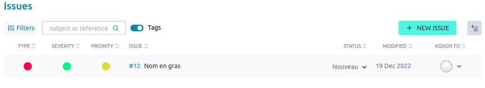
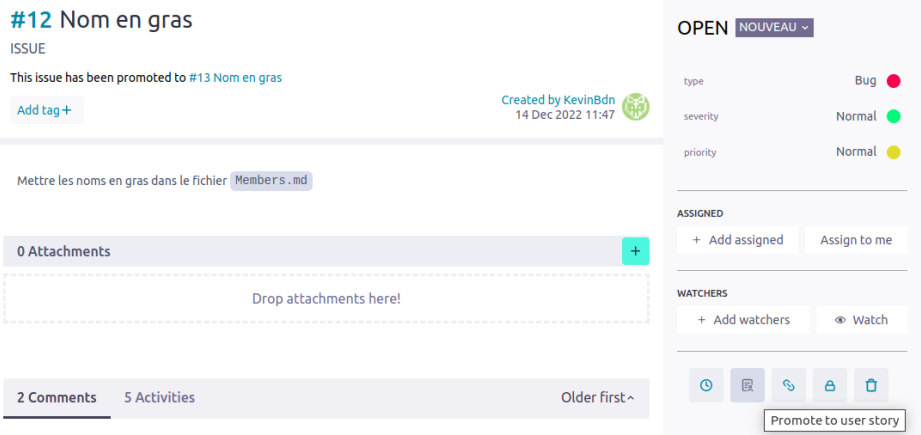

Exercice 8
===

### Objectifs
--- 

* **TAIGA**: Linker le projet avec TAIGA
* **GIT**: Gestion des issues

---	
### Consignes

* **[PO]** 

	1. Créer le *Sprint5*
	
	2. Créer les *US* de l'exercice, les tâches asssociées et les attribuer.
	
	3. Intégrer **Github** à **TAIGA** ([https://docs.taiga.io/integrations-github.html](https://docs.taiga.io/integrations-github.html))
	
	4. Ouvrir une issue sur le repo **Github** du **GM** en demandant de mettre les noms des membres en gras. L'issue devrait s'ouvrir dans **TAIGA**
	
	
	
	5. Transformer l'issue en *US* sur le projet **TAIGA**
	
	
	
	6. La rajouter au *Sprint* courant en attribuant la tache à réaliser au **GM**
	
	7. Une fois l'issue résolue vérifier qu'elle passe bien à "Fermé" sur **TAIGA**
	
	8. Mettre à jour ses branches local/online avec celles du **GM**
	
			$ git checkout main
			$ git pull upstream main
			$ git push origin main
			$ git chekout devel
			$ git pull origin main
			$ git push origin devel
	
	9. Vérifier l'exercice
		
			$ ../TP-IS3A-GIT-TAIGA/Ex08/verif_ex08.sh
			
	10. A l'issu de l'exercice le *Sprint5* doit être clos
		
* **[GM]**

	1. Résoudre l'issue créée par le **PO** via le repo devel local. Le commit doit identifier l'issue résolue
	
			$ git checkout devel
			$ nano Teams/Members.md
				...
			$ git add Teams/Members.md
			$ git commit -m "Fix bug #XX : members's name bolded"
			$ git push origin devel
		
	2. Mettre à jour la branche `main` en local puis pousser sur le repo **Github**
	
			$ git checkout main
			$ git pull origin devel
			$ git push origin main
		
	3.  Vérifier l'exercice
		
			$ ../TP-IS3A-GIT-TAIGA/Ex08/verif_exo8.sh
