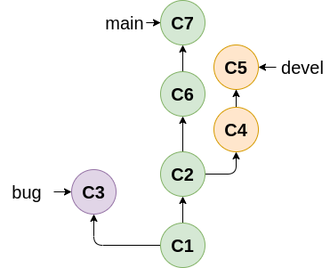
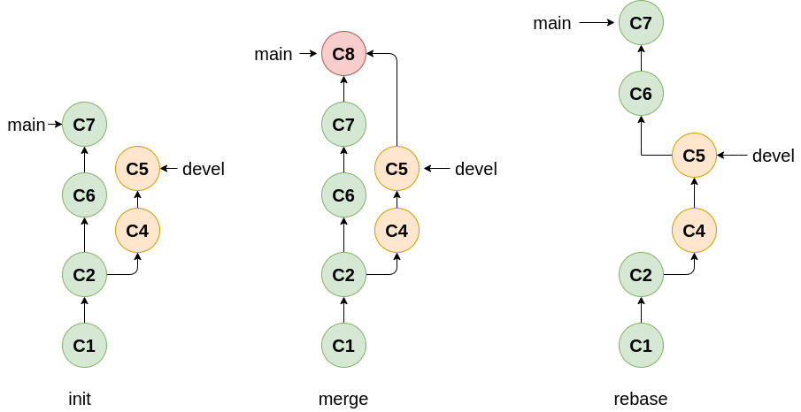
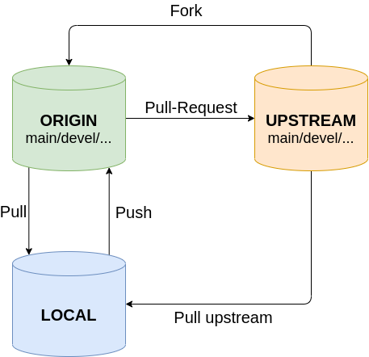
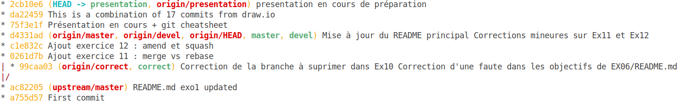

<style>

section {
  background-color: #fefefe;
  color: #333;
}

img[alt~="center"] {
  display: block;
  margin: 0 auto;
}
blockquote {
  background: #ffedcc;
  border-left: 10px solid #d1bf9d;
  margin: 1.5em 10px;
  padding: 0.5em 10px;
}
blockquote:before{
  content: unset;
}
blockquote:after{
  content: unset;
}
</style>

<!-- _class: lead -->
# Git and Github 
---
# Vous avez dit Git ?
- **Version Control System (VCS)** (crée par Linus Thorvald) 
- Pour suivre les évolution de ses fichiers/projets:
  - Quand ont-ils été créés / modifées ?
  - Par qui ? Pourquoi ?
  - Permet d'avoir plusieurs version organisé d'un même fichier
- Associé à un hébergeur en ligne (Gitlab ou Github par example)
- Permet la collaboration dans le développement
---
# Installation
- Ubuntu / Debian : ` apt install git`
- Windows : installateur dispo sur https://msysgit.github.io/


---
# Initialisation d'un répertoire
- A partir d'un dossier local : 
```bash 
git init
```
- A partir d'un projet existant :
```bash
git clone <URL>
```

---

# Les répertoires
- Le répertoire local sur votre machine
- Le répertoire distant sur un hébergeur
>
> - `git pull <remote> <branch> `: Met à jour le repo LOCAL à partir du DISTANT
> - `git push <remote> <branch>` : Met à jour le repo DISTANT à partir du LOCAL 
---
# Les commits
- Pour figer l'état des modifications du répertoire actuel
- Possède une référence 
ex : `0261d7b Ajout exercice 11 : merge vs rebase`

> - `git add <file>` : ajoute les fichiers à commit
> - `git commit -m "Your message"` : indexe les modifications des fichiers avec un message significatif des changements
_(Github : un # suivi du numéro de l'issue pour faire  lien)_
---
# Statut de mon répertoire local

> `git status` : connaître le status de son répertoire

```bash
On branch presentation
Changes to be committed:
  (use "git restore --staged <file>..." to unstage)
	modified:   README.md

Untracked files:
  (use "git add <file>..." to include in what will be committed)
	fichier_modifie.md

```
---
# Branches
- Utile pour développer des fonctionnalités sans casser le projet
- Une branche **main** avec une version qui fonctionne TOUJOURS !
- Utilisation de _tags_

> `git branch [option]` 
> `git checkout <branch>` 

 &nbsp;

---
# Fusion de branche en local
- `git checkout <branche_accueil_fusion>` : se mettre sur la branche qui accueillera la fusion
- `git merge <branche_à_rappatrier>` pour fusionner branche_à_rappatrier sur la branche qui accueil la fusion

---
# Fusion de branche 

- `git fetch <remote> <branch>` : rappatrie les modifications 
- `git merge <remote>/<branch>` : ajout au sommet 
- `git rebase <remote>/<branch>` : ajout chronologique 
> `git pull <remote> <branch>` = fetch + merge
> `git pull --rebase <remote> <branch>` = fetch + rebase

---
# Merge et Rebase


---
# Merge et Rebase
> `rebase` : permet de garder un **historique linéaire** avec la branche du répertoire principal.
=> quand on travail sur **son fork, ou sur des branches de développement** 

> `merge` ajoute un commit de merge
=> quand on travail **la branche main du répertoire principal**

---
# Merge et Rebase
> **ATTENTION** `rebase` réecrit l'historique et peut conduire à des situations complexe s'il est utilisé sur la branche main (ou tout autre branche partagée avec d'autre)

>Après un **rebase** il sera surement nécéssaire de faire un force push pour réecrire la branche distante `git push -f origin <branche_courante>`
---
# Fork
- Crée une copie pour pouvoir y travailler dessus avant de proposer de nouvelles fontionnalités (Pull-Request) 
- Se fait depuis Github (ou autre hébergeur)

 &nbsp;

---
# Remote
- Permet de pointer vers les différents répertoires distants pour interragir avec (pull/push)
- origin / upstream
 &nbsp;
---
# Travailler avec un fork
1. Cloner son fork : `git clone <URL_Fork>`
2. Ajout de la remote upstream : `git add remote upstream <URL>`
3. Se mettre à jour :
  - `git fetch <remote> <branch>` (ex : _git fetch upstream main_)
  - `git rebase <remote>/<branch>` ou `git merge <remote>/<branch>`
4. Développer ses fonctionnalités
5. Ne pas oublier de se mettre régulièrement à jour avec le repo upstream, proposer des modification (**Pull-Request**)
---
# Je suis perdu
- `git status`
- `git log` ou `git log --graph --oneline --all` : affiche l'historique des commits
- `git reflog` : affiche l'historique des actions sur le repo
- `git diff [<file>]` : affiche les modifications 
- `git [command] --help` ou `man git` (ou Internet) !

---
# Je suis perdu
`git log --graph --oneline --all`



---

# Aie, j'ai fait une erreur !
- `git commit --amend` : modifier le dernier commit non push
- `git reset [--hard] <ref>` : revenir à un point spécial
- Réecrire l'historique : `git rebase -i HEAD~<nombre_de_commit_à_remonter>` 

> **ATTENTION** ces commandes peuvent réécrire l'historique et le rendre incompatible avec les répertoires distants. Bien faire attention avant de force push (`git push -f <remote> <branch>`) 

---
# Conflit
- Apparait quand il y a une même portion de fichier modifié à plusieurs endroit (ex : sur 2 branches différentes)
- Pour résoudre le conflit : ouvrir le/les fichiers avec votre éditeur préféré et choisir que faire puis `add` et `commit` la résolution

```
<<<<<<< HEAD (Current Change)
This is conflicting branch line.
=======
# Upwork
Upwork projects
>>>>>>> main (Incomming Change)
```
---
# Fichiers spéciaux
- .gitignore 
```txt
.pyc
/tmt/*
```
- README.md

- License : MIT, GPL3, Apache2.0, ...

- Comment collaborer, liste des collaborateurs, ...

---
# Trucs utiles

- Un bon IDE : (certains diront **OBLIGATOIRE**) : VScode, Atom, Clion, Pycharm, ...
- Pour le terminal : [ZSH et Oh My Zsh](https://github.com/ohmyzsh/ohmyzsh/wiki/Installing-ZSH) 
- Petit outils : [Meld](https://meldmerge.org/), [GitKraken](https://www.gitkraken.com/), [Qgit](https://sourceforge.net/projects/qgit/)

- Intégration : Github, Gitlab, FramaGit...        
- Gestion de projet : [Taïga.io](https://www.taiga.io/)
---
# Un monde à découvrir

- `git stash` : sauvergarder les mofications et revenir au dernier commit
- `git revert`,  `git blame`, `git whatchanged`, `git show`, ...
- les submodules : répertoire git dans un répertoire git
- github actions, wiki, team, ...
- github CLI (commandes `gh [option]`)

---
# Conclusion

- Un des meilleurs VCS
- Bien intégré, avec beaucoup d'outils (via Github notament mais pas que)
- ~~Un peu~~ Difficile au début 

**Bref, à pratiquer !**